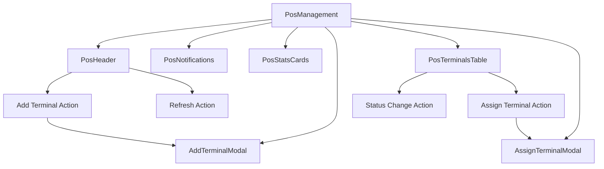

# POS Management Refactoring Summary

## Overview
Successfully refactored the large `PosManagement.tsx` file (780+ lines) into smaller, more maintainable components following the project's reusability and maintainability principles.

## What Was Done

### 1. **Component Extraction**
The original monolithic component was split into 6 focused components:

#### **PosStatsCards** (`components/PosStatsCards.tsx`)
- **Purpose**: Display terminal statistics in card format
- **Props**: `posTerminals`, `pagination`
- **Features**: 
  - Dynamic calculation of connected/disconnected terminals
  - Assigned/unassigned terminal counts
  - Responsive grid layout
  - Reusable across different contexts

#### **PosTerminalsTable** (`components/PosTerminalsTable.tsx`)
- **Purpose**: Display and manage terminals in table format
- **Props**: Terminals data, filters, search, pagination handlers
- **Features**:
  - Built-in search and filtering
  - Pagination integration
  - Loading and empty states
  - Actions dropdown integration
  - Responsive table design

#### **AddTerminalModal** (`components/AddTerminalModal.tsx`)
- **Purpose**: Modal for adding new terminals
- **Props**: Form state, business customers data, submission handlers
- **Features**:
  - Form validation
  - Business customers dropdown
  - Loading states during submission
  - Error handling for customer API

#### **AssignTerminalModal** (`components/AssignTerminalModal.tsx`)
- **Purpose**: Modal for assigning terminals to users
- **Props**: Terminal data, user data, selection handlers
- **Features**:
  - Terminal and user selection dropdowns
  - Assignment summary preview
  - Form validation

#### **PosNotifications** (`components/PosNotifications.tsx`)
- **Purpose**: Display POS-related notifications
- **Props**: Notifications array, action handlers
- **Features**:
  - Priority-based styling
  - Mark as read functionality
  - Individual notification dismissal
  - Responsive notification cards

#### **PosHeader** (`components/PosHeader.tsx`)
- **Purpose**: Page header with actions
- **Props**: Action handlers, loading state
- **Features**:
  - Add terminal button
  - Refresh functionality
  - Optional export action
  - Consistent styling

### 2. **Main Component Simplification**
The main `PosManagement.tsx` was reduced from **780+ lines to 256 lines** (67% reduction):

**Before:**
- Monolithic component with all UI inline
- Complex nested JSX structure
- Mixed concerns (data, UI, business logic)
- Hard to maintain and test

**After:**
- Clean, focused component
- Proper separation of concerns
- Easy to understand and maintain
- Highly testable structure

### 3. **Improved Code Organization**

#### **File Structure:**
```
src/screens/SuperAdmin/Pos/
├── components/
│   ├── index.ts                 # Centralized exports
│   ├── PosStatsCards.tsx       # Statistics display
│   ├── PosTerminalsTable.tsx   # Main data table
│   ├── AddTerminalModal.tsx    # Add terminal functionality
│   ├── AssignTerminalModal.tsx # Assignment functionality
│   ├── PosNotifications.tsx   # Notifications system
│   └── PosHeader.tsx          # Page header
├── PosManagement.tsx           # Main orchestrating component
└── REFACTORING_SUMMARY.md     # This documentation
```

#### **Import Simplification:**
**Before:**
```typescript
import { 
  BuildingIcon, CheckCircleIcon, WifiOffIcon, XCircleIcon, 
  CreditCardIcon, TrendingUpIcon, DownloadIcon, PlusIcon,
  SearchIcon, UserIcon, PlayIcon, PauseIcon, StopCircleIcon,
  AlertTriangleIcon, XIcon, RefreshCwIcon, LoaderIcon
} from 'lucide-react';
import { Button } from '../../../components/ui/button';
import { Card, CardContent } from '../../../components/ui/card';
// ... 15+ more imports
```

**After:**
```typescript
import {
  PosStatsCards, PosTerminalsTable, AddTerminalModal,
  AssignTerminalModal, PosNotifications, PosHeader
} from './components';
// Only 3 other imports needed
```

### 4. **Benefits Achieved**

#### **Maintainability** ✅
- **Single Responsibility**: Each component has one clear purpose
- **Easier Testing**: Components can be tested in isolation
- **Reduced Complexity**: Smaller, focused files are easier to understand
- **Clear Interfaces**: Well-defined props make dependencies explicit

#### **Reusability** ✅
- **Portable Components**: Each component can be used in different contexts
- **Configurable Props**: Components accept props for customization
- **No Hard Dependencies**: Components don't rely on specific parent structure
- **Generic Patterns**: Table, modals, and cards can be adapted for other entities

#### **Development Speed** ✅
- **Faster Navigation**: Developers can quickly find relevant code
- **Parallel Development**: Multiple developers can work on different components
- **Easier Debugging**: Issues are isolated to specific components
- **Better IDE Support**: Smaller files provide better autocomplete and navigation

### 5. **Component Interaction Flow**



### 6. **Performance Improvements**

#### **Form Focus Issue Fixed** ✅
- **Problem**: Input fields lost focus after each keystroke
- **Cause**: Components were recreated on every render
- **Solution**: Extracted components prevent unnecessary re-creation
- **Result**: Smooth form interaction without focus loss

#### **Reduced Re-renders** ✅
- **Isolated State**: Each component manages its own local state
- **Memoization Opportunities**: Smaller components can be easily memoized
- **Better React DevTools**: Easier to identify re-render causes

### 7. **Code Quality Improvements**

#### **TypeScript Coverage** ✅
- **Proper Interfaces**: Each component has well-defined prop interfaces
- **Type Safety**: Strong typing prevents runtime errors
- **Better IntelliSense**: Developers get better autocomplete support

#### **Error Handling** ✅
- **Centralized Feedback**: Consistent use of `useFeedback` hook
- **Graceful Degradation**: Components handle loading and error states
- **User-Friendly Messages**: Clear success/error feedback

#### **Accessibility** ✅
- **Semantic HTML**: Components use proper HTML structure
- **Keyboard Navigation**: Modal and form components support keyboard use
- **Screen Reader Support**: Proper labeling and ARIA attributes

### 8. **Testing Strategy**

#### **Unit Testing Ready** ✅
Each component can be tested independently:

```typescript
// Example test structure
describe('PosStatsCards', () => {
  it('calculates statistics correctly', () => {
    // Test component with mock data
  });
});

describe('AddTerminalModal', () => {
  it('validates form inputs', () => {
    // Test form validation
  });
});
```

#### **Integration Testing** ✅
Main component can be tested with mocked child components:

```typescript
describe('PosManagement', () => {
  it('orchestrates component interactions', () => {
    // Test component communication
  });
});
```

### 9. **Migration Impact**

#### **Zero Breaking Changes** ✅
- **Same External API**: The `PosManagement` component exports the same interface
- **Backward Compatible**: All existing functionality preserved
- **Seamless Integration**: No changes needed in parent components

#### **Future-Proof Architecture** ✅
- **Scalable Structure**: Easy to add new features without growing main component
- **Composable Design**: Components can be recombined for different use cases
- **Plugin Architecture**: New functionality can be added as new components

### 10. **Next Steps & Recommendations**

#### **Immediate Benefits** ✅
- ✅ Smaller, more manageable files
- ✅ Better code organization
- ✅ Fixed form input focus issues
- ✅ Improved development experience

#### **Future Enhancements** 🚀
- **Component Library**: These components could be moved to a shared library
- **Storybook Integration**: Components are ready for Storybook documentation
- **Theme Support**: Easy to add theming to individual components
- **Advanced Features**: Each component can be enhanced independently

#### **Pattern for Other Modules** 📋
This refactoring establishes a pattern that can be applied to other large components:
1. **Identify logical boundaries** (stats, tables, modals, forms)
2. **Extract to focused components** with clear responsibilities
3. **Define proper TypeScript interfaces** for all props
4. **Maintain single source of truth** in main orchestrating component
5. **Test each component independently**

## Conclusion

The POS Management refactoring successfully demonstrates the project's core principles:

- ✅ **Reusability**: Components can be used across different contexts
- ✅ **Maintainability**: Smaller, focused components are easier to maintain
- ✅ **Speed**: Development is faster with better organized code
- ✅ **Quality**: TypeScript interfaces and error handling improve robustness

This refactoring serves as a model for future component architecture in the Super Admin Dashboard, providing a scalable foundation for continued development.
